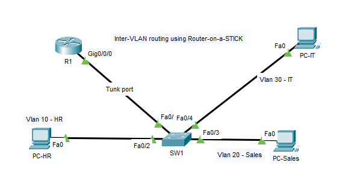

# VLAN Routing – Cisco Packet Tracer

## Objective

Simulate a company network with three departments (HR, Sales, IT) using VLANs and configure inter-VLAN communication through a router using the Router-on-a-Stick method.

## Devices Used

- 1 Router
- 1 Switch
- 3 PCs
- Copper straight-through cables

## VLAN Configuration

| Department | VLAN Name | VLAN ID |
|------------|-----------|---------|
| HR         | HR        | 10      |
| Sales      | SALES     | 20      |
| IT         | IT        | 30      |

## IP Addressing Scheme

| PC      | IP Address     | VLAN | Gateway        |
|---------|----------------|------|----------------|
| PC-HR   | 192.168.10.10  | 10   | 192.168.10.1   |
| PC-Sales| 192.168.20.10  | 20   | 192.168.20.1   |
| PC-IT   | 192.168.30.10  | 30   | 192.168.30.1   |

## Key Configurations

### On the Switch:
```bash
vlan 10
name HR
vlan 20
name SALES
vlan 30
name IT

interface fa0/2
switchport mode access
switchport access vlan 10

interface fa0/3
switchport mode access
switchport access vlan 20

interface fa0/4
switchport mode access
switchport access vlan 30

interface fa0/1
switchport mode trunk
```

### On the Router:
```bash
interface fa0/0.10
encapsulation dot1Q 10
ip address 192.168.10.1 255.255.255.0

interface fa0/0.20
encapsulation dot1Q 20
ip address 192.168.20.1 255.255.255.0

interface fa0/0.30
encapsulation dot1Q 30
ip address 192.168.30.1 255.255.255.0
```

## Tests Performed

- Ping from PC-HR to PC-Sales: ✅
- Ping from PC-HR to PC-IT: ✅
- Confirmed VLAN isolation without router: ✅
- Confirmed inter-VLAN routing via subinterfaces: ✅

## Topology Screenshot



---

 Packet Tracer File:`02-Vlan-routing.pkt` 
 Screenshot:`02-Topology.PNG`
