# Advanced Troubleshooting & Inter-VLAN Routing Lab – Cisco Packet Tracer

## Objective

This lab simulates real-world Layer 1–3 troubleshooting scenarios in a small business environment. You'll also configure inter-VLAN routing to enable communication between isolated departments across subnets. Each configuration issue introduced is based on situations an IT support specialist or network administrator might face.

---

## Real-Life Scenario

A mid-sized company has two departments:
- **Sales (VLAN 20)** using IP range `192.168.50.0/24`
- **Engineering** using IP range `192.168.60.0/24`

Initially, the departments are segmented for security. However, Sales and Engineering begin a collaborative project and require limited cross-communication. Network admins configure **inter-VLAN routing** to securely enable this.

At the same time, users report connectivity issues due to cable problems, misconfigured gateways, and disabled ports — your task is to troubleshoot and fix these issues.

---

##  Devices Used

- 1 Router (R1)
- 3 Switches (SW1, SW2 and SW3)
- 4 PCs:
  - PC1: Sales (VLAN 20, connected to SW1)
  - PC2: Sales (VLAN 20, connected to SW2)
  - PC3: Sales (VLAN 20, connected to SW2)
  - PC4: Engineering (new subnet recently added)
- Ethernet cables (straight-through)

---

## Configuration Overview

###  On SW1:
```bash
vlan 20
name SALES

interface range fa0/2-3
switchport mode access
switchport access vlan 20

interface fa0/1
switchport mode trunk
```

###  On SW2:
```bash
interface range fa0/1-3
switchport mode access
```

###  On Router R1:
```bash
interface gig0/0.20
encapsulation dot1Q 20
ip address 192.168.50.1 255.255.255.0

interface gig0/1
ip address 192.168.60.1 255.255.255.0
no shutdown
```

###  On PCs:
- **PC1**: `192.168.50.10 /24`, Gateway: `192.168.50.1`
- **PC2**: `192.168.50.11 /24`, Gateway: `192.168.50.1`
- **PC3**: `192.168.50.12 /24`, Gateway: `192.168.50.1`
- **PC4**: `192.168.60.10 /24`, Gateway: `192.168.60.1`

---

In this lab, we simulate a misconfigured (or purposely disabled) port to understand its impact on connectivity.

---

## Troubleshooting Scenarios

### Scenario 1:  VLAN Mismatch
PC1 is assigned VLAN 10 as part of an old vlan configuration, while the new section of the sales department.
- Result: No connectivity.
- Fix: Configure VLAN 20 on SW1.

 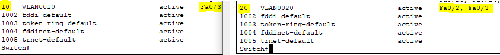 
 
 ------------
 
 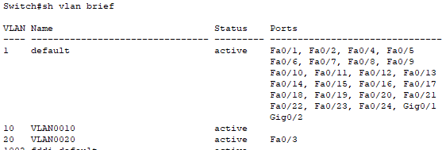

-Confirmation: PC1 has connectivity to PC2
-
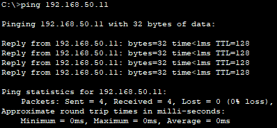

---

### Scenario 2:  Wrong Gateway on PC2
A user manually set `192.168.50.99` as gateway while setting the engineering department at PC3.
- Result: PC3 can't reply to PC4 on the other subnet.
- Fix: Set correct gateway: `192.168.50.1`

 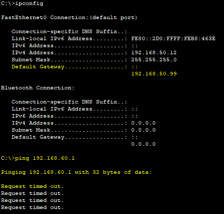
 
 -
 
 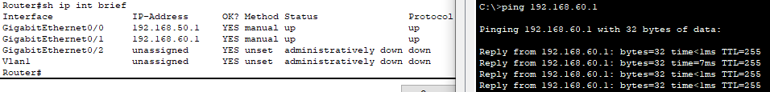 
 
 -
 
 → 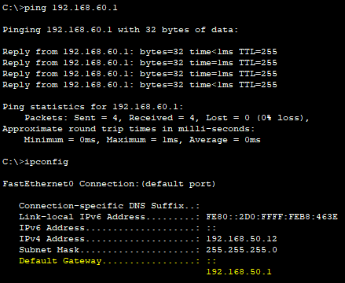

---

### Scenario 3: Port Admin Down
##  Security Practice: Admin Down a Port
A common security measure is to **administratively shut down unused switch ports** to prevent rogue device connections or lateral attacks.
IT disabled a port on purpose but forgot to re-enable it when expanding the network.
- Result: PC can't connect.
- Fix: Bring port back up.

```bash
interface fa0/2
no shutdown
```

 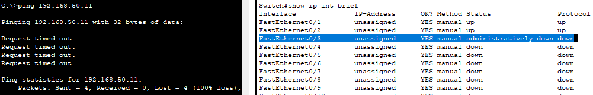
 
 -
 →  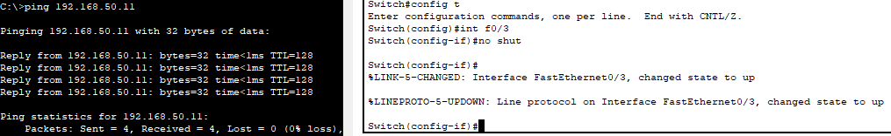

---

## End-to-End Test

From **PC1**, ping:
```bash
ping 192.168.60.10
```

From **PC4**, ping:
```bash
ping 192.168.50.10
```

 Success confirms:
- Inter-VLAN routing is working
- Troubleshooting steps resolved the issues

  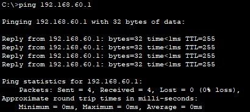
---

## Screenshots Summary

| Screenshot                       | Purpose                                       |
|----------------------------------|-----------------------------------------------|
|  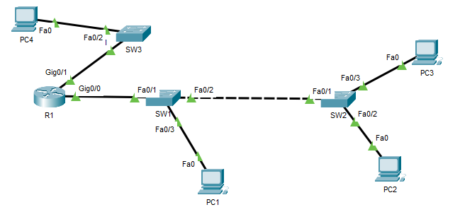 | Overall network layout with VLANs and IPs     |
| `vlan-config-sw1.png`            | VLAN and trunk setup                          |
| `router-intervlan-config.png`    | Subinterface and routing config               |
| 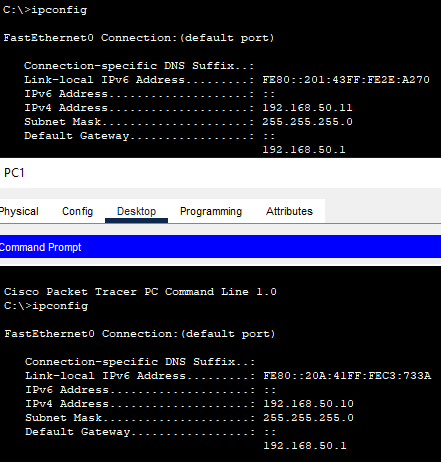       | IP configs on PCs                             |
|      | Successful inter-VLAN ping                    |
|                | Wrong gateway config on PC2                   |
|    | Fixed gateway                                |
|             | Disabled port scenario                        |
|       | Port enabled and restored                     |

---

## Key Takeaways

- Understand and isolate problems by OSI layer (1–3)
- Proper VLAN and trunk configuration is critical for routing
- Always verify IP addressing and gateway configuration
- Use administrative shutdowns for security, but manage carefully
- Document everything — screenshots prove what you fixed

---

📁 Project File: `04-troubleshooting-failover.pkt`  
📂 Screenshots folder: `/images/`

This lab mirrors real helpdesk and network admin environments — practice here, and you’ll be ready for the field.
