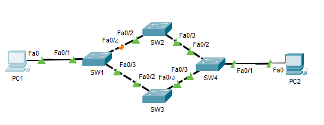
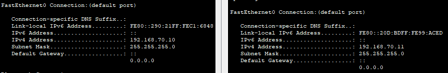
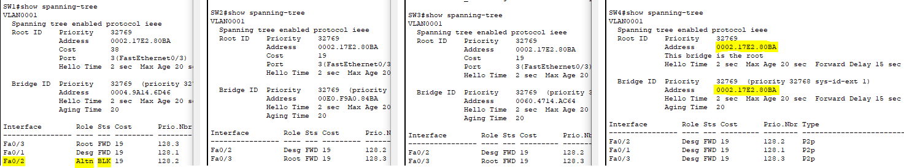
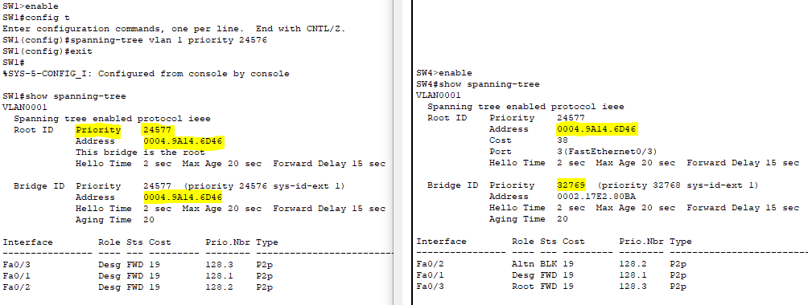
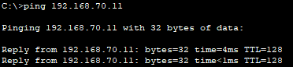
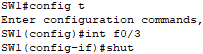
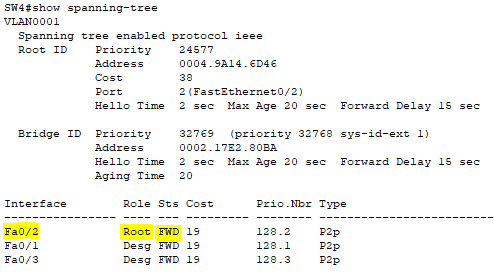

# STP and Redundant Path Lab (4-Switch Topology) – Cisco Packet Tracer

##  Objective

Simulate a high-availability Layer 2 network using four interconnected switches and Spanning Tree Protocol (STP). Demonstrate how STP elects a root bridge, blocks redundant paths to prevent switching loops, and automatically recovers connectivity in case of a link failure.

---

##  Real-World Scenario

A company implements a highly redundant switch network across four distribution switches to ensure continuous connectivity. STP ensures only one path is active at a time while keeping backup links in standby. This lab mirrors such enterprise scenarios where reliability is mission-critical.

---

##  Devices Used

- 4 Switches (SW1, SW2, SW3, SW4)
- 2 PCs (PC1, PC2)

---

##  Topology Diagram

```
PC1 --> SW1 <---> SW2
        |              |
        v              v
       SW3 <---> SW4 <--- PC2
```

 

---

##  IP Addressing

| PC   | IP Address     | Subnet Mask     |
|------|----------------|-----------------|
| PC1  | 192.168.70.10  | 255.255.255.0   |
| PC2  | 192.168.70.11  | 255.255.255.0   |



---

##  STP Configuration

STP (PVST+) is enabled by default.

###  Commands to Observe STP:

```bash
enable
show spanning-tree
```

- Identify the root bridge
- Locate blocking ports



---

## Force SW1 to Be Root Bridge

```bash
configure terminal
spanning-tree vlan 1 priority 24576
end
```



---

##  Testing Procedure

###  Before Failure:
```bash
ping 192.168.70.11
```


###  Simulate Link Failure:
- Disconnect SW1↔SW3 or SW2↔SW4


  
- STP recalculates and unblocks another path



---

## Screenshot Summary

| File                          | Description                          |
|-------------------------------|--------------------------------------|
|           | Visual layout of the topology        |
|        | PC IP configuration                 |
| stp-root-election-blocked-port.PNG         | Root bridge output from SW1         |
| stp-root-election-blocked-port.PNG      | Blocked port on SW3                 |
| stp-root-election-blocked-port.PNG      | Blocked port on SW4                 |
|         | Forcing SW1 as root bridge          |
|       | Successful ping between PCs         |
|               | STP recovering after link failure   |

---

## Key Takeaways

- STP automatically blocks redundant links to prevent loops
- A root bridge is elected based on priority + MAC
- Only one active path exists at a time; backups are ready
- STP re-converges automatically if a link fails
- This mirrors real enterprise-grade switch redundancy design

---

📁 Project File: `05-Spanning-tree-protocol.pkt`  
📂 Images Folder: `/images/`

This lab reinforces your understanding of STP behavior, link redundancy, and failure recovery — all of which are essential skills for any network admin.
