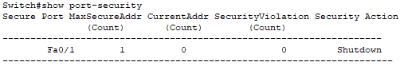
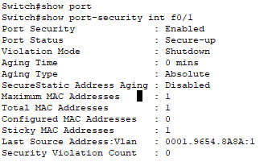
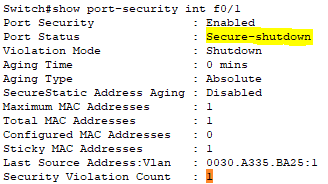
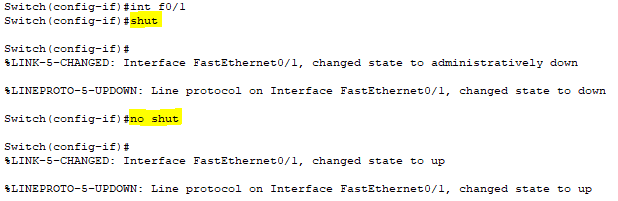
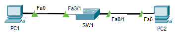

# Day 9: Port Security and Switch-Level Access Control – Cisco Packet Tracer

##  Objective

Implement basic port security on Cisco switches to prevent unauthorized devices from connecting to the network. This lab demonstrates how MAC address filtering can mitigate attacks such as MAC flooding or unauthorized host access in enterprise environments.

---

##  Real-World Scenario

In an office environment, a user plugs in a rogue laptop to access internal systems. With **port security**, only known devices are allowed to connect. When an unauthorized MAC address attempts access, the switch disables the port or sends an alert.

---

##  Devices Used

- 1 Switch (SW1)
- 2 PCs (PC1 - authorized, PC2 - unauthorized)
- Copper straight-through cables

---

##  Lab Setup

| Device | Port      | IP Address      | MAC Bound? |
|--------|-----------|-----------------|------------|
| PC1    | Fa0/1     | 192.168.80.10   |  YES     |
| PC2    | Fa0/1     | 192.168.80.11   |  NO      |

---

## 🔧 Configuration on SW1

```bash
enable
configure terminal

interface fa0/1
switchport mode access
switchport port-security
switchport port-security maximum 1
switchport port-security mac-address sticky
switchport port-security violation shutdown
```

Use `show port-security` to verify learning and enforcement.



Or more specific `show port-security int x` to have more detailed information



---

##  Testing Procedure

1. Connect PC1 to Fa0/1 — should be accepted
2. Disconnect PC1 and connect PC2 — should trigger shutdown
3. Use `show port-security interface fa0/1` to confirm violation
4. Recover the port using:
```bash
interface fa0/1
shutdown
no shutdown
```

   


 
 

---

##  Screenshots to Capture

| Image Name                       | Description                              |
|----------------------------------|------------------------------------------|
|        | Topology showing PC1, PC2, and SW1       |
|          | Switch CLI config for port security      |
|   | Violation triggered when PC2 connects    |
|                 | Port recovery via shutdown/no shutdown   |

---

##  Key Takeaways

- Port security limits access to specific MAC addresses
- Violations can trigger alerts, restrict access, or shut down ports
- Sticky MACs help secure endpoints while still learning dynamically
- Useful for enterprise desk switches and access control zones

---

 Project File: `06-port-security.pkt`  
 Screenshots folder: `/images/`
