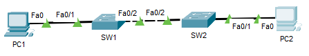
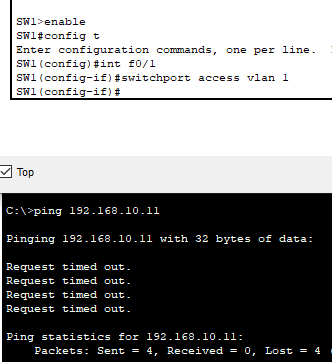
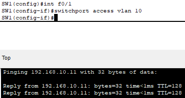
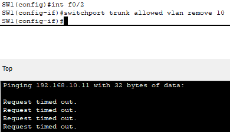
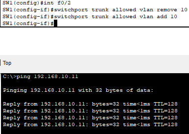

# Day 10: VLAN Misconfiguration and Inter-Switch Communication – Cisco Packet Tracer

##  Objective

Identify and correct VLAN misconfigurations that prevent inter-device communication across switches. This lab replicates real-world issues like access ports in the wrong VLAN, missing trunk links, or VLANs not being allowed across trunks.

---

## 🏢 Real-World Scenario

In an office with multiple departments, some users report they can't communicate with others in their team. A technician discovers their ports were misconfigured on the wrong VLAN, or that VLANs weren’t propagated across trunk links between switches.

---

##  Devices Used

- 2 Switches (SW1, SW2)
- 2 PCs (PC1, PC2)
- Ethernet cables (straight-through)

---

## 🖧 Network Setup

| Device | Port      | VLAN | IP Address     |
|--------|-----------|------|----------------|
| PC1    | SW1 Fa0/1 | 10   | 192.168.10.10  |
| PC2    | SW2 Fa0/1 | 10   | 192.168.10.11  |
| SW1 ↔ SW2 | Fa0/2  | trunk| (Inter-switch) |

---

##  Configuration Steps

### On SW1 and SW2:
```bash
vlan 10
name STAFF
```

### On PC Access Ports:
```bash
interface fa0/1
switchport mode access
switchport access vlan 10
```

### On Inter-Switch Link:
```bash
interface fa0/2
switchport mode trunk
switchport trunk allowed vlan 10
```

---

##  Troubleshooting Tasks

1. Set PC2 to VLAN 1 (default) by mistake → test failed ping
2. Set PC2 back to VLAN 10 → test success
3. Remove VLAN 10 from trunk → test failed ping
4. Add VLAN 10 back to trunk → test success
5. Add VLAN 20 to PC1 and test → ping fails

---

##  Screenshots to Capture

| Image Name               | Description                                      |
|--------------------------|--------------------------------------------------|
|         | Topology with PC1, PC2, and switches             |
|   | Ping fail when PC2 in wrong VLAN                |
|  | Ping works after VLAN correction              |
|    | Ping fail when VLAN 10 removed from trunk       |
|  | Ping success when trunk config is corrected     |

---

##  Key Takeaways

- VLANs must match across access ports to communicate
- Trunks must allow the relevant VLANs
- A single misconfigured port or trunk can break connectivity
- Always verify VLAN membership and trunk settings during troubleshooting

---

 Project File: `vlan-misconfig.pkt`  
 Screenshots folder: `/images/`
