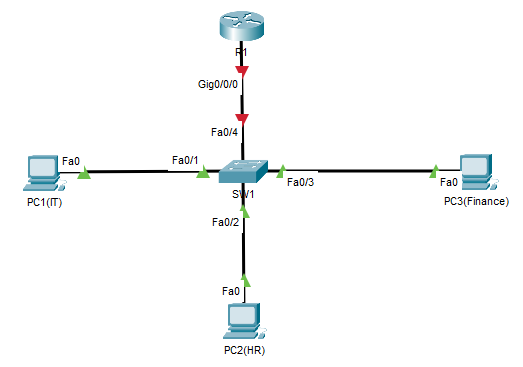

# Inter-VLAN Routing (Router-on-a-Stick Configuration) – Cisco Packet Tracer

##  Objective

Set up inter-VLAN routing using a single router interface (Router-on-a-Stick).  
This lab demonstrates how to enable communication between multiple VLANs (IT, HR, and Finance) through subinterfaces.

---

## Real-World Scenario

A growing company separates departments into VLANs for security and traffic management:
- **IT (VLAN 10)** – Administrative team  
- **HR (VLAN 20)** – Human resources  
- **Finance (VLAN 30)** – Accounting department  

Although isolated, these departments must communicate securely through a central router.  
You’ll use **802.1Q encapsulation** to route between VLANs.

---

## Devices Used

- 1 Router (R1)
- 1 Switch (SW1)
- 3 PCs (PC1 – IT, PC2 – HR, PC3 – Finance)
- Straight-through Ethernet cables

---

##  Network Topology

```
           [Router R1]
               |
          g0/0 trunk link
               |
          --------------
          |    SW1     |
          |-------------|
     Fa0/1  Fa0/2  Fa0/3
      |       |      |
    PC1     PC2     PC3
   VLAN10  VLAN20  VLAN30
```



---

##  Configuration Steps

### Step 1 — Create VLANs on SW1

```bash
enable
configure terminal
vlan 10
name IT
vlan 20
name HR
vlan 30
name FINANCE
exit
```

---

### Step 2 — Assign Access Ports

```bash
interface fa0/1
switchport mode access
switchport access vlan 10
exit

interface fa0/2
switchport mode access
switchport access vlan 20
exit

interface fa0/3
switchport mode access
switchport access vlan 30
exit
```

 `images/vlan-config.png`

---

### Step 3 — Configure the Trunk Between Switch and Router

```bash
interface fa0/24
switchport mode trunk
switchport trunk allowed vlan 10,20,30
exit
```

 Fa0/24 connects to Router R1’s `g0/0` interface.

 `images/trunk-config.png`

---

### Step 4 — Configure Router-on-a-Stick on R1

```bash
enable
configure terminal

interface g0/0
no shutdown
exit

interface g0/0.10
encapsulation dot1Q 10
ip address 192.168.10.1 255.255.255.0
exit

interface g0/0.20
encapsulation dot1Q 20
ip address 192.168.20.1 255.255.255.0
exit

interface g0/0.30
encapsulation dot1Q 30
ip address 192.168.30.1 255.255.255.0
exit
```

 `images/router-subinterfaces.png`

---

### Step 5 — Configure IPs on PCs

| PC | VLAN | IP Address | Subnet Mask | Gateway |
|----|------|-------------|--------------|----------|
| PC1 | 10 | 192.168.10.10 | 255.255.255.0 | 192.168.10.1 |
| PC2 | 20 | 192.168.20.10 | 255.255.255.0 | 192.168.20.1 |
| PC3 | 30 | 192.168.30.10 | 255.255.255.0 | 192.168.30.1 |

 `images/pc-ip-configs.png`

---

##  Testing Connectivity

From **PC1 (VLAN 10)**:
```bash
ping 192.168.20.10
ping 192.168.30.10
```

 Expected result:
```
Reply from 192.168.20.10: bytes=32 time<1ms TTL=128
Reply from 192.168.30.10: bytes=32 time<1ms TTL=128
```

 `images/ping-success.png`


##  Troubleshooting Scenarios

| Problem | Symptom | Fix |
|----------|----------|-----|
| Wrong VLAN on PC port | Ping fails between VLANs | Assign correct VLAN |
| Missing trunk config | No inter-VLAN communication | Configure trunk on Fa0/4 |
| Incorrect encapsulation ID | Ping fails between VLANs | Match VLAN IDs on subinterfaces |

 `images/troubleshooting.png`

---

##  Key Takeaways

- VLANs isolate departments at Layer 2  
- Router-on-a-Stick enables Layer 3 communication between VLANs  
- `encapsulation dot1Q` tags VLAN traffic for routing  
- A single router interface can manage multiple VLANs using subinterfaces  

---

 Packet Tracer File: `intervlan-routing.pkt`  
 Screenshot Folder: `images/`
