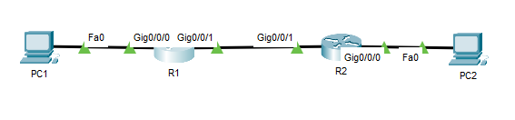
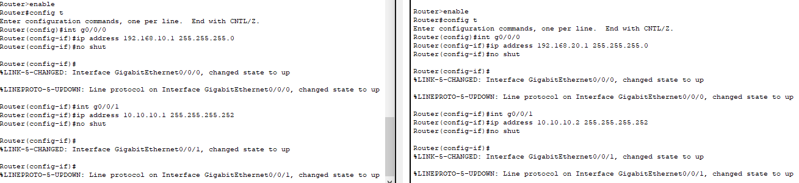
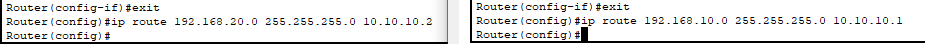
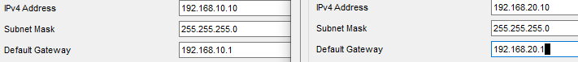
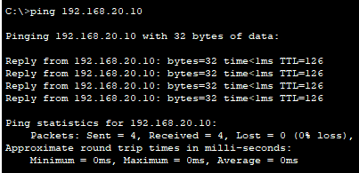
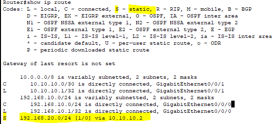

# Static Routing Between Routers – Cisco Packet Tracer

##  Objective

Configure and verify static routing between two routers to enable communication between different LAN networks.

---

##  Real-World Scenario

Your company has expanded to a second office building. Each building has its own LAN managed by a dedicated router.  
Your task is to configure **static routes** between both routers so users from one site can communicate with users at the other.

---

##  Devices Used

- 2 Routers (R1 – Headquarters, R2 – Branch)
- 2 PCs (PC1 – HQ, PC2 – Branch)
- Ethernet/Serial connection between routers
- Straight-through cables for LAN connections

---

##  Network Topology

```
         [HQ LAN]                   [Branch LAN]
        192.168.10.0/24            192.168.20.0/24
         PC1 ---- R1 ----- R2 ---- PC2
                G0/1     G0/1
                |         |
           10.10.10.0/30 (WAN link)
```

 
 
---

##  IP Addressing Table

| Device | Interface | IP Address | Subnet Mask | Description |
|---------|------------|-------------|--------------|-------------|
| R1 | G0/0 | 192.168.10.1 | 255.255.255.0 | HQ LAN |
| R1 | G0/1 | 10.10.10.1 | 255.255.255.252 | WAN link |
| R2 | G0/1 | 10.10.10.2 | 255.255.255.252 | WAN link |
| R2 | G0/0 | 192.168.20.1 | 255.255.255.0 | Branch LAN |
| PC1 | NIC | 192.168.10.10 | 255.255.255.0 | HQ User |
| PC2 | NIC | 192.168.20.10 | 255.255.255.0 | Branch User |

---

##  Step 1 — Configure IPs on Routers

### On R1:
```bash
enable
configure terminal
interface g0/0
ip address 192.168.10.1 255.255.255.0
no shutdown
exit

interface g0/1
ip address 10.10.10.1 255.255.255.252
no shutdown
exit
```

### On R2:
```bash
enable
configure terminal
interface g0/0
ip address 192.168.20.1 255.255.255.0
no shutdown
exit

interface g0/1
ip address 10.10.10.2 255.255.255.252
no shutdown
exit
```

 
 
---

##  Step 2 — Configure Static Routes

### On R1:
```bash
ip route 192.168.20.0 255.255.255.0 10.10.10.2
```

### On R2:
```bash
ip route 192.168.10.0 255.255.255.0 10.10.10.1
```

 

---

##  Step 3 — Configure PCs

| PC | IP Address | Subnet Mask | Default Gateway |
|----|-------------|--------------|-----------------|
| PC1 | 192.168.10.10 | 255.255.255.0 | 192.168.10.1 |
| PC2 | 192.168.20.10 | 255.255.255.0 | 192.168.20.1 |

 

---

##  Step 4 — Test Connectivity

From **PC1 (HQ)**:
```bash
ping 192.168.20.10
```

 Expected output:
```
Reply from 192.168.20.10: bytes=32 time<1ms TTL=128
```

If the ping fails, verify:
- Interfaces are up (`show ip interface brief`)
- Static routes are correct (`show ip route`)
- IPs and gateways match (`show running-config`)



---

##  Verification Commands

On **R1** or **R2**:
```bash
show ip route
show running-config
show interfaces g0/0
```

 
 

---

##  Troubleshooting Scenarios

| Problem | Symptom | Fix |
|----------|----------|-----|
| Missing static route | Ping fails across routers | Add correct static route |
| Wrong next-hop IP | Ping fails | Verify next-hop matches the neighbor router interface |
| Interface shutdown | No connectivity | Use `no shutdown` on both WAN ports |


---

##  Key Takeaways

- Static routes manually define paths between networks.  
- Both routers must know each other's LAN networks.  
- Static routing is simple, stable, and ideal for small topologies.  
- Forms the foundation for dynamic routing (RIP, OSPF, EIGRP).

---

 Packet Tracer File: `static-rout.pkt`  
 Screenshot Folder: `images/`
