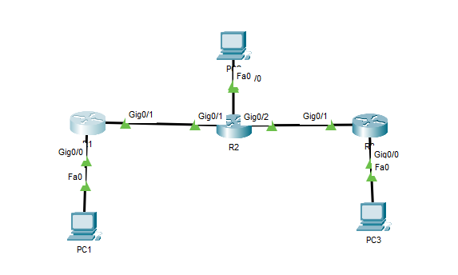

# Dynamic Routing with OSPF (Open Shortest Path First) – Cisco Packet Tracer

##  Objective

Configure and verify **OSPF (Open Shortest Path First)** to dynamically exchange routing information between multiple routers.

---

##  Real-World Scenario

Your company is expanding its internal network backbone.  
To improve scalability and performance, you've been asked to migrate from RIP to OSPF across all routers:
- R1 (Headquarters)
- R2 (Branch)
- R3 (Remote Office)

OSPF will automatically share routes between routers, calculate the shortest path, and adjust when links go down.

---

##  Devices Used

- 3 Routers (R1 – HQ, R2 – Branch, R3 – Remote)
- 3 PCs (one per LAN)
- Ethernet connections between routers
- Straight-through cables for LANs

---

##  Network Topology
---
      [HQ LAN]        [Branch LAN]        [Remote LAN]
    192.168.10.0     192.168.20.0        192.168.30.0
        PC1              PC2                  PC3
         |                |                    |
        R1 -------------- R2 -------------- R3
      (10.10.10.0)     (10.20.20.0)
---


---

## ⚙️ IP Addressing Table

| Device | Interface | IP Address | Subnet Mask | Description |
|---------|------------|-------------|--------------|-------------|
| R1 | G0/0 | 192.168.10.1 | 255.255.255.0 | HQ LAN |
| R1 | G0/1 | 10.10.10.1 | 255.255.255.0 | Link to R2 |
| R2 | G0/0 | 192.168.20.1 | 255.255.255.0 | Branch LAN |
| R2 | G0/1 | 10.10.10.2 | 255.255.255.0 | Link to R1 |
| R2 | G0/2 | 10.20.20.1 | 255.255.255.0 | Link to R3 |
| R3 | G0/0 | 192.168.30.1 | 255.255.255.0 | Remote LAN |
| R3 | G0/1 | 10.20.20.2 | 255.255.255.0 | Link to R2 |

---

## ⚙️ Step 1 — Configure Router Interfaces

*(Ensure all interfaces are up and configured as shown in the table.)*

---

## ⚙️ Step 2 — Enable OSPF on All Routers

### On R1:
```bash
enable
configure terminal
router ospf 1
network 192.168.10.0 0.0.0.255 area 0
network 10.10.10.0 0.0.0.255 area 0
exit


ON R2

enable
configure terminal
router ospf 1
network 192.168.20.0 0.0.0.255 area 0
network 10.10.10.0 0.0.0.255 area 0
network 10.20.20.0 0.0.0.255 area 0
exit

On R3:

enable
configure terminal
router ospf 1
network 192.168.30.0 0.0.0.255 area 0
network 10.20.20.0 0.0.0.255 area 0
exit

🖼️ images/ospf-config.png

⚙️ Step 3 — Verify Neighbor Adjacency
show ip ospf neighbor


✅ Expected output:
Each router should see its direct neighbor listed.

🖼️ images/ospf-neighbors.png

⚙️ Step 4 — Verify Learned Routes
show ip route ospf


✅ You should see OSPF-learned routes marked with an O in the routing table.

🖼️ images/show-ip-route-ospf.png

🧪 Step 5 — Test Connectivity

From PC1 (192.168.10.10):

ping 192.168.30.10


 Expected output:

Reply from 192.168.30.10: bytes=32 time<1ms TTL=128


 images/ping-success-ospf.png

 Optional — Adjust OSPF Cost to Simulate Best Path
interface g0/1
ip ospf cost 100


 Lower cost = higher priority path. OSPF dynamically recalculates the best route.

🖼️ images/ospf-cost.png

 Troubleshooting Scenarios
Problem	Symptom	Fix
No adjacency	Neighbor Down	Ensure both routers are in the same area and subnet
Routes missing	Incomplete routing table	Verify network statements
Link flapping	Intermittent connectivity	Check cable and interface status

 images/ospf-troubleshooting.png

 Key Takeaways

OSPF is a link-state protocol, building a complete map of the network.
Faster, more efficient, and scalable than RIP.
Uses cost metric instead of hop count.

All routers in area 0 must be fully connected for adjacency.

Packet Tracer File: Dynamic-Routing-OSPF.pkt
Screenshot Folder: images/
