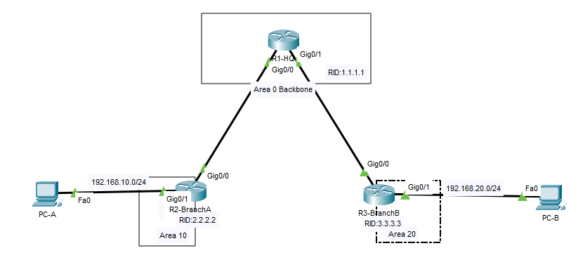
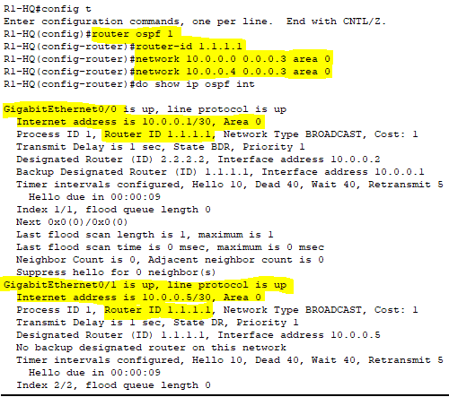
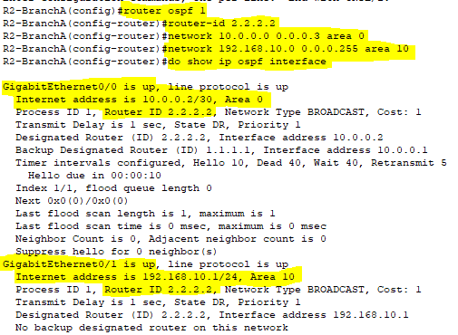
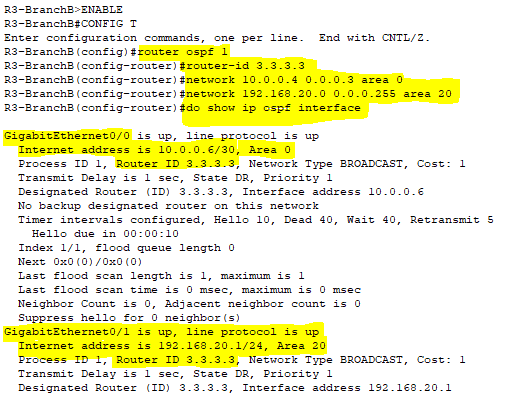
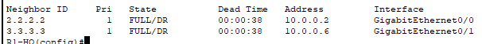
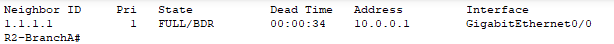
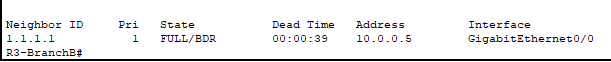
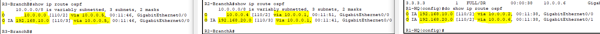
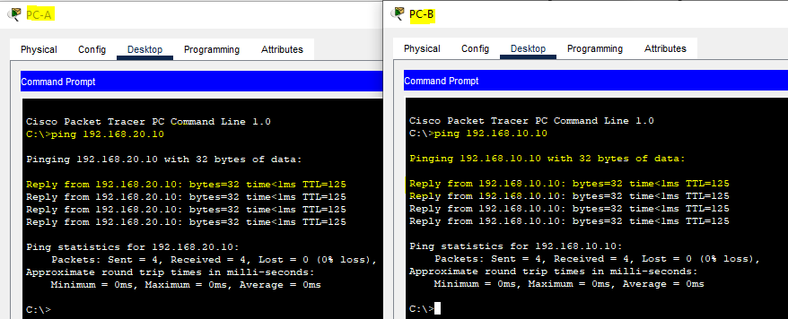
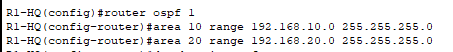

# Day 23–24 — Multi-Area OSPF Lab (Final README)

##  Overview
This lab introduces OSPF multi-area routing in an enterprise-style, 3‑router environment.  
You will configure Areas 0, 10, and 20, form neighbor adjacencies, verify LSDB, and test end‑to‑end routing.

##  Topology (Text Description)

```
                   +-------------------+
                   |     R1-HQ         |
                   |  Area 0 Backbone  |
                   |  RID: 1.1.1.1     |
                   +-------------------+
                        /        \
                       /          \
              Area 10 /            \ Area 20
                     /              \
             +--------------+   +--------------+
             |   R2-BranchA |   |  R3-BranchB |
             |  RID:2.2.2.2 |   |  RID:3.3.3.3|
             +--------------+   +--------------+
                |                      |
      LAN A ----+                      +---- LAN B
   (192.168.10.0/24)             (192.168.20.0/24)
```

## 📦 IP Schema

### R1-HQ (Area 0)
- g0/0 — 10.0.0.1/30 → R2  
- g0/1 — 10.0.0.5/30 → R3  

### R2 (Area 10)
- g0/1 — 192.168.10.1/24  
- g0/0 — 10.0.0.2/30  

### R3 (Area 20)
- g0/1 — 192.168.20.1/24  
- g0/0 — 10.0.0.6/30  

### PCs
- PC-A: 192.168.10.10/24, GW 192.168.10.1  
- PC-B: 192.168.20.10/24, GW 192.168.20.1  

---



---
#  Configuration Steps

## STEP 1 — Assign Router IDs
### R1:
```
router ospf 1
 router-id 1.1.1.1
```

### R2:
```
router ospf 1
 router-id 2.2.2.2
```

### R3:
```
router ospf 1
 router-id 3.3.3.3
```
---

## STEP 2 — Configure OSPF Areas

### R1
```
router ospf 1
 network 10.0.0.0 0.0.0.3 area 0
 network 10.0.0.4 0.0.0.3 area 0
```

### R2
```
router ospf 1
 network 10.0.0.0 0.0.0.3 area 0
 network 192.168.10.0 0.0.0.255 area 10
```

### R3
```
router ospf 1
 network 10.0.0.4 0.0.0.3 area 0
 network 192.168.20.0 0.0.0.255 area 20
```





---

## STEP 3 — Verify OSPF Neighbors
```
show ip ospf neighbor
```
Expected:
- R1 sees neighbors R2 & R3  
- R2 sees R1  
- R3 sees R1  





---

## STEP 4 — Verify Routing Table
```
show ip route ospf
```
Expected:
- R1 learns both LANs  
- R2 learns LAN B  
- R3 learns LAN A  



---

## STEP 5 — Test PC Connectivity

### PC-A → PC-B:
```
ping 192.168.20.10
```

### PC-B → PC-A:
```
ping 192.168.10.10
```



---

## STEP 6 (Optional) — Area Summarization
```
router ospf 1
 area 10 range 192.168.10.0 255.255.255.0
 area 20 range 192.168.20.0 255.255.255.0
```



---

#  Verification Commands
```
show ip ospf neighbor
show ip ospf database
show ip route ospf
show ip ospf interface brief
```

---

#  Troubleshooting Guide

| Issue | Cause | Fix |
|-------|--------|--------|
| Neighbor stuck in INIT | Mask mismatch | Check interface IP/mask |
| No adjacency | Wrong area | Ensure non-backbone → Area 0 |
| No OSPF routes | Bad network statement | Correct wildcard masks |
| PCs can't ping | Wrong gateway | Fix PC default gateway |
| Missing LAN routes | LAN not included in OSPF | Add LAN network command |

---
##  Key Takeaways

- Multi-Area OSPF is designed for scalability and stability.

- Breaking the network into smaller areas reduces LSA flooding & lowers CPU load.  
- Area separation improves performance and convergence.
- ABRs (Area border Routers) act as boundaries and forward summarized routes..  
- Multi-Area design organizes networks into logical segments.
- Different area types unlock advanced OSPF behavior.
- Multi-Area OSPF prepares networks for real enterprise growth.

---

 Packet Tracer File: `multi-area-ospf.pkt`  
 Screenshot Folder: `Images/`
