# HSRP + Redundant Core for Esports VLANs (Option C)

## 🎯Overview
This lab simulates a **redundant Layer 3 core** for an esports / events network using:
- Two redundant **HSRP core routers**
- Two Layer 2 switches with **EtherChannel** between them
- Multiple **esports-focused VLANs**
- Default gateway redundancy with **HSRP failover**
- STP-safe L2 design
- End-to-end tests from different “roles” (broadcast, game, casters, production, management)

This is a high-availability design similar to what you’d expect in a real tournament or live-event environment.

---

##  Topology (Logical Overview)

Devices:
- R1 – Core Router A (HSRP)
- R2 – Core Router B (HSRP)
- SW1 – Distribution / Core Switch
- SW2 – Access Switch
- Multiple PCs on SW2 in different VLANs

High-level layout:
```
      R1 (Core A)                       R2 (Core B)
      g0/0 (trunk)                      g0/0 (trunk)
           |                                  |
           |                                  |
        SW1 (Dist/Core)  <== L2 EtherChannel ==>  SW2 (Access)
                                         |
                                      PCs in:
                           VLAN10 – Broadcast Control
                           VLAN20 – Game Clients
                           VLAN30 – Casters/Analysts
                           VLAN40 – Production
                           VLAN50 – Management
```

- R1 and R2 act as **default gateways via HSRP** for each VLAN.
- SW1 and SW2 are pure Layer 2; routing happens on the routers.

---

##  VLAN & IP Plan (Esports-Oriented)

### VLAN IDs and Roles

| VLAN | Name               | Purpose                      |
|------|--------------------|------------------------------|
| 10   | BROADCAST_CTRL     | Event control / TD room      |
| 20   | GAME_CLIENTS       | Players’ PCs / game traffic  |
| 30   | CASTERS            | Casters / analysts PCs       |
| 40   | PRODUCTION         | Replay, editing, ingest PCs  |
| 50   | MGMT               | Management / admin network   |

### Gateway IPs and HSRP Virtual IPs

Each VLAN uses R1/R2 subinterfaces with a shared HSRP virtual IP.

| VLAN | Subnet           | R1 IP          | R2 IP          | HSRP VIP (Gateway)  |
|------|------------------|----------------|----------------|---------------------|
| 10   | 10.10.10.0/24    | 10.10.10.1     | 10.10.10.2     | 10.10.10.254        |
| 20   | 10.20.20.0/24    | 10.20.20.1     | 10.20.20.2     | 10.20.20.254        |
| 30   | 10.30.30.0/24    | 10.30.30.1     | 10.30.30.2     | 10.30.30.254        |
| 40   | 10.40.40.0/24    | 10.40.40.1     | 10.40.40.2     | 10.40.40.254        |
| 50   | 10.50.50.0/24    | 10.50.50.1     | 10.50.50.2     | 10.50.50.254        |

PCs in each VLAN use the **HSRP VIP** as their default gateway.

---

##  Physical Connections (Suggested)

You can adapt interfaces according to Packet Tracer, but one clean mapping is:
- R1 g0/0 → SW1 Fa0/1
- R2 g0/0 → SW1 Fa0/2
- SW1 Fa0/3 ↔ SW2 Fa0/1
- SW1 Fa0/4 ↔ SW2 Fa0/2  (Fa0/3–4 and Fa0/1–2 form an EtherChannel trunk)

SW2 access ports:
- Fa0/5 → PC-Broadcast (VLAN10)
- Fa0/6 → PC-Game (VLAN20)
- Fa0/7 → PC-Caster (VLAN30)
- Fa0/8 → PC-Production (VLAN40)
- Fa0/9 → PC-Management (VLAN50)
---

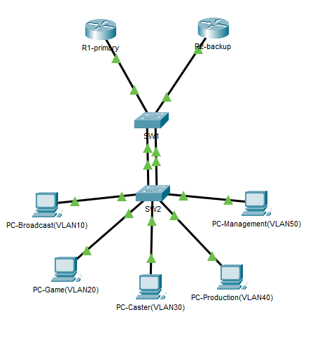

---

#  Step 1 — Configure VLANs on SW1 and SW2

On **SW1** and **SW2**:
```bash
vlan 10
 name BROADCAST_CTRL
vlan 20
 name GAME_CLIENTS
vlan 30
 name CASTERS
vlan 40
 name PRODUCTION
vlan 50
 name MGMT
```
---

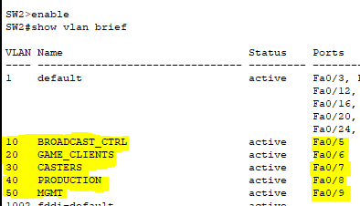

---

#  Step 2 — Configure the EtherChannel (SW1 ↔ SW2)

We will use **Port-Channel1** as a trunk between SW1 and SW2.

## On SW1:
```bash
interface range fa0/3 - 4
 switchport mode trunk
 channel-group 1 mode active    ! LACP
exit

interface port-channel1
 switchport mode trunk
```

## On SW2:
```bash
interface range fa0/1 - 2
 switchport mode trunk
 channel-group 1 mode active    ! LACP
exit

interface port-channel1
 switchport mode trunk
```

Verification:
```bash
show etherchannel summary
show interfaces trunk
```

---

#  Step 3 — Configure Trunks to Routers on SW1

On **SW1**:
```bash
interface fa0/1
 switchport mode trunk
 switchport trunk allowed vlan 10,20,30,40,50

interface fa0/2
 switchport mode trunk
 switchport trunk allowed vlan 10,20,30,40,50
```

These are **router-on-a-stick trunks** for R1 and R2.
---

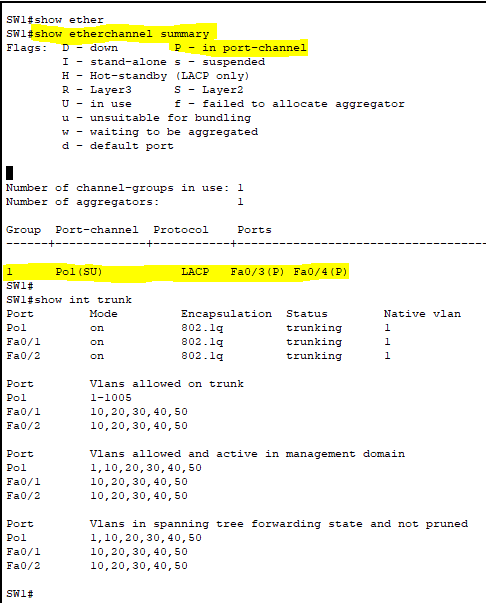

---

#  Step 4 — Configure Access Ports on SW2

On **SW2**:
```bash
interface fa0/5
 switchport mode access
 switchport access vlan 10

interface fa0/6
 switchport mode access
 switchport access vlan 20

interface fa0/7
 switchport mode access
 switchport access vlan 30

interface fa0/8
 switchport mode access
 switchport access vlan 40

interface fa0/9
 switchport mode access
 switchport access vlan 50
```

Connect the correct PC to each port.

---

#  Step 5 — Configure Router Subinterfaces & HSRP

## On R1 (Primary / Active)
```bash
interface g0/0
 no shutdown

interface g0/0.10
 encapsulation dot1q 10
 ip address 10.10.10.1 255.255.255.0
 standby 10 ip 10.10.10.254
 standby 10 priority 110
 standby 10 preempt

interface g0/0.20
 encapsulation dot1q 20
 ip address 10.20.20.1 255.255.255.0
 standby 20 ip 10.20.20.254
 standby 20 priority 110
 standby 20 preempt

interface g0/0.30
 encapsulation dot1q 30
 ip address 10.30.30.1 255.255.255.0
 standby 30 ip 10.30.30.254
 standby 30 priority 110
 standby 30 preempt

interface g0/0.40
 encapsulation dot1q 40
 ip address 10.40.40.1 255.255.255.0
 standby 40 ip 10.40.40.254
 standby 40 priority 110
 standby 40 preempt

interface g0/0.50
 encapsulation dot1q 50
 ip address 10.50.50.1 255.255.255.0
 standby 50 ip 10.50.50.254
 standby 50 priority 110
 standby 50 preempt
```

---

## On R2 (Standby / Backup)
```bash
interface g0/0
 no shutdown

interface g0/0.10
 encapsulation dot1q 10
 ip address 10.10.10.2 255.255.255.0
 standby 10 ip 10.10.10.254

interface g0/0.20
 encapsulation dot1q 20
 ip address 10.20.20.2 255.255.255.0
 standby 20 ip 10.20.20.254

interface g0/0.30
 encapsulation dot1q 30
 ip address 10.30.30.2 255.255.255.0
 standby 30 ip 10.30.30.254

interface g0/0.40
 encapsulation dot1q 40
 ip address 10.40.40.2 255.255.255.0
 standby 40 ip 10.40.40.254

interface g0/0.50
 encapsulation dot1q 50
 ip address 10.50.50.2 255.255.255.0
 standby 50 ip 10.50.50.254
```
---

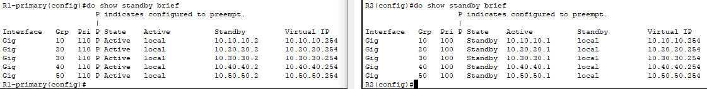

---

#  Step 6 — Configure PC IPs

Each PC should be configured with:
- IP in the correct subnet
- Mask /24
- Default gateway = HSRP VIP (.254)

Example:
- Broadcast PC: `10.10.10.10 /24`, GW `10.10.10.254`
- Game PC: `10.20.20.10 /24`, GW `10.20.20.254`
- Caster PC: `10.30.30.10 /24`, GW `10.30.30.254`
- Production PC: `10.40.40.10 /24`, GW `10.40.40.254`
- Management PC: `10.50.50.10 /24`, GW `10.50.50.254`

---

#  Step 7 — Verification & Failover Tests

## 1. Verify EtherChannel & Trunks
```bash
show etherchannel summary
show interfaces trunk
```

## 2. Verify HSRP
```bash
show standby brief
```
Expected:
- R1: Active for groups 10–50
- R2: Standby for groups 10–50

## 3. Test Connectivity
From each PC:
- Ping its default gateway
- Ping other PCs (once routing between VLANs is added in a future lab)
---

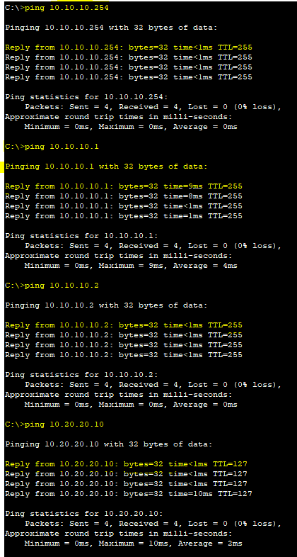

---

#  Step 8 — HSRP Failover

1. Check HSRP state:
```bash
show standby brief
```
2. Simulate failure on R1:
```bash
interface g0/0
 shutdown
```
3. Check HSRP on R2 — it should now be **Active**.
4. Repeat pings from PCs — traffic should continue with minimal disruption.
5. Bring R1 back:
```bash
interface g0/0
 no shutdown
```
With **preempt** set, R1 will take back the Active role.
---

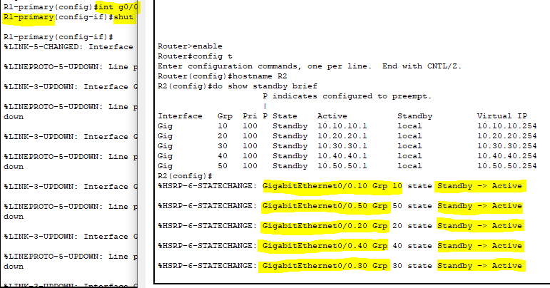
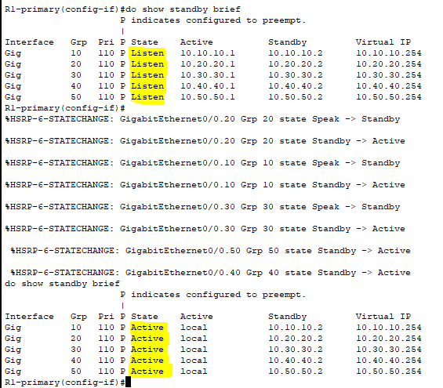
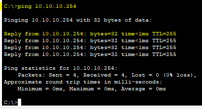
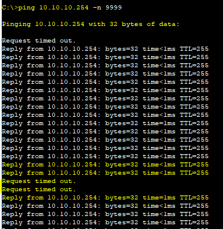

---

#  Key Takeaways (Esports Context)

- **HSRP** gives you a **virtual default gateway**, ensuring that if one core router fails, player PCs, broadcast stations, production, and management continue operating.
- **EtherChannel** provides higher bandwidth and redundancy between switches while still looking like a single link to STP.
- Segregating roles into **esports-specific VLANs** (game clients, broadcast, casters, production, management) mirrors real tournament network design.
- This lab demonstrates **Layer 2 + Layer 3 redundancy**, a critical requirement in live events and broadcast environments.

---

# Extended Section — ACL Segmentation Add-On
---

## ACL Segmentation Between VLANs (Add-On to HSRP Lab)

In many real esports, production, or broadcast networks, certain VLANs must not communicate with others, even though HSRP and inter-VLAN routing are enabled.
For example:

Game Clients (VLAN20) must NEVER reach

Production VLAN (VLAN40)

Management VLAN (VLAN50)

Management and Production can still reach Game Clients (VLAN 20)

But VLAN20 can still talk to

Broadcast (VLAN10)

Casters (VLAN30)

To implement this, we add Layer 3 ACLs to router subinterfaces.
This ensures that security policy persists even during HSRP failover, since the ACLs are applied on both R1 and R2.

---
# Goal of This Extension

 Block:

VLAN 20 → VLAN 40

VLAN 20 → VLAN 50

✔ Allow:

VLAN 20 → VLAN 10

VLAN 20 → VLAN 30

All other normal inter-VLAN communication

This gives you production-grade segmentation while keeping full redundancy.

---

# Step 1 — Create ACLs on R1 (Primary Router)

```bash
conf t
ip access-list extended ACL_VLAN20_BLOCK_4050
! Block Game → Production
 deny ip 10.20.20.0 0.0.0.255 10.40.40.0 0.0.0.255
! Block Game → Management
 deny ip 10.20.20.0 0.0.0.255 10.50.50.0 0.0.0.255
 permit ip any any
exit
```

# Step 2 — Create the Same ACLs on R2 (Standby Router)

(Ensures security continues even during failover)

```bash
conf t
ip access-list extended ACL_VLAN20_BLOCK_4050
! Block Game → Production
 deny ip 10.20.20.0 0.0.0.255 10.40.40.0 0.0.0.255
! Block Game → Management
 deny ip 10.20.20.0 0.0.0.255 10.50.50.0 0.0.0.255
 permit ip any any
exit
```
---

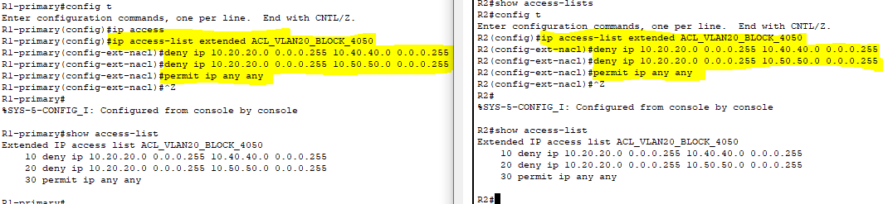

---

# Step 3 — Apply ACLs to the VLAN20 Subinterface (Inbound)

Since VLAN20 is the source of the restricted traffic, apply ACLs inbound on its router subinterface.

On R1:
```bash
interface g0/0.20
 ip access-group ACL_VLAN20_BLOCK_4050 in
 
```

On R2:
```bash
interface g0/0.20
 ip access-group ACL_VLAN20_BLOCK_4050 in
```

---

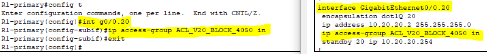

---

# Step 4 — Test the ACL Behavior

✔ From Game PC (VLAN20):

Expected to FAIL:

ping 10.40.40.10   ! Production PC
ping 10.50.50.10   ! Management PC


Expected to WORK:

ping 10.10.10.10   ! Broadcast VLAN PC
ping 10.30.30.10   ! Casters VLAN PC
ping 10.20.20.254  ! HSRP Gateway

---

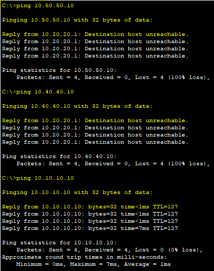

---
## Why This Matters (Esports Context)

ACL-based segmentation is critical because:

- Game machines must NEVER reach production equipment prevents cheating, tampering, or stream-embedded attacks.
- Production gear must not expose management interfaces reduces human error and security breaches.
- Restricted VLANs still rely on HSRP so ACLs must be on BOTH routers to maintain consistent policy.
- EtherChannel ensures high-bandwidth & redundancy perfect for video/graphics/replay workflows.


This is exactly the network engineering mindset expected in Riot Games, ESL, Blast, FaceIt, DreamHack, and LEC productions
