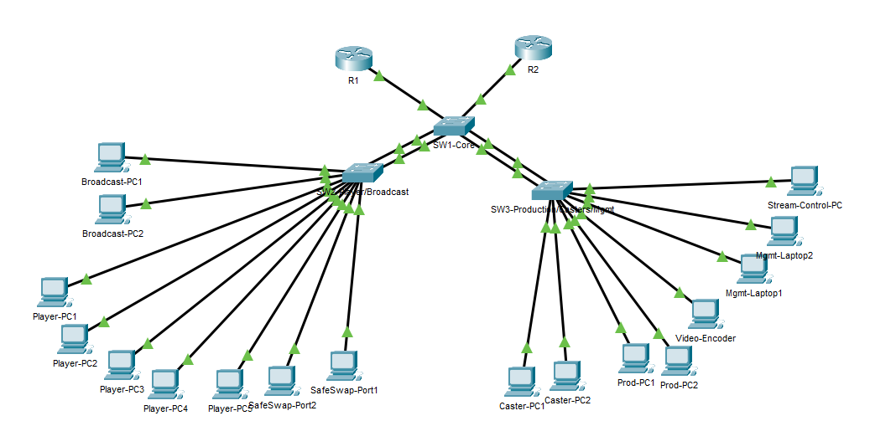
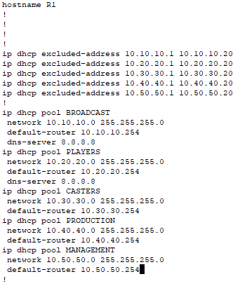
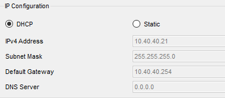
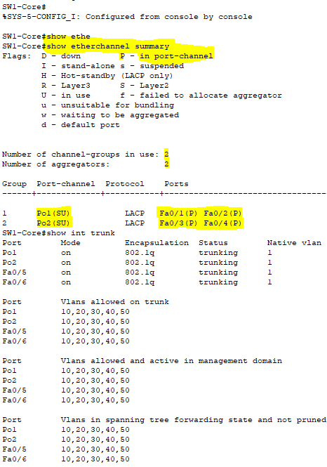
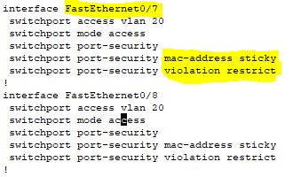
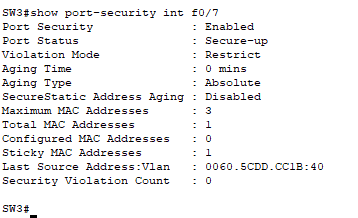
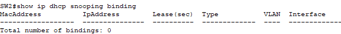

# 🎮 Esports Network Security Lab  
**VLANs • HSRP • EtherChannel • DHCP • Port Security • Theoretical DHCP Snooping/DAI**

---

## 📌 Overview

This project builds a multi-VLAN, multi-switch esports network that simulates a real LAN tournament infrastructure.

Technologies implemented:

- **Layer-2 VLAN segmentation**
- **Router-on-a-Stick** (R1/R2)
- **HSRP** for gateway redundancy
- **DHCP** with excluded ranges + multiple scopes
- **EtherChannel (LACP)** uplinks
- **Port Security** on user-facing ports
- *(Theoretical)* **DHCP Snooping + Dynamic ARP Inspection**  
  → Packet Tracer does not fully support snooping bindings with EtherChannels; documented below

This README includes:

- Working configs  
- Theoretical security configs  
- Screenshot guidance  
- Real-world explanations  

---

# 🗺 Final Topology (Insert Your Screenshot)



---

# 🧱 Device Roles

| Device | Role |
|--------|------|
| **SW1-Core** | L2 Core, trunk hub, EtherChannel aggregator |
| **SW2** | Broadcast/Players access switch (VLAN 10/20) |
| **SW3** | Casters/Production/Management access switch (VLAN 30/40/50) |
| **R1/R2** | Redundant routers running HSRP + DHCP |

---

# 🎨 VLANs

| VLAN | Name       | Purpose |
|------|------------|---------|
| 10   | PLAYERS    | Esports players |
| 20   | BROADCAST  | Cameras, encoder gear |
| 30   | CASTERS    | Caster desk devices |
| 40   | PRODUCTION | Studio gear (OBS, mixers) |
| 50   | MGMT       | IT, admins, coaches |

---

# 🌐 Router Configuration (Example: R1)

```bash
interface g0/0.10
 encapsulation dot1q 10
 ip address 10.10.10.1 255.255.255.0
 standby 10 ip 10.10.10.254
 standby 10 priority 110
 standby 10 preempt
```

*(Repeat for VLANs 20,30,40,50)*

---

# 🔑 DHCP Configuration (R1)

```bash
ip dhcp excluded-address 10.10.10.1 10.10.10.20
ip dhcp excluded-address 10.20.20.1 10.20.20.20
ip dhcp excluded-address 10.30.30.1 10.30.30.20
ip dhcp excluded-address 10.40.40.1 10.40.40.20
ip dhcp excluded-address 10.50.50.1 10.50.50.20

ip dhcp pool PLAYERS
 network 10.10.10.0 255.255.255.0
 default-router 10.10.10.254

ip dhcp pool BROADCAST
 network 10.20.20.0 255.255.255.0
 default-router 10.20.20.254

ip dhcp pool CASTERS
 network 10.30.30.0 255.255.255.0
 default-router 10.30.30.254

ip dhcp pool PRODUCTION
 network 10.40.40.0 255.255.255.0
 default-router 10.40.40.254

ip dhcp pool MGMT
 network 10.50.50.0 255.255.255.0
 default-router 10.50.50.254
```
---

📸 **Screenshots to include:**
- `show run | section dhcp`



- PC DHCP settings showing correct IP/GW/DNS



---

# 🔗 EtherChannel (LACP)

### SW2 / SW3:

```bash
interface range fa0/1 - 2
 switchport mode trunk
 switchport trunk allowed vlan 10,20,30,40,50
 channel-group 1 mode active
```

### SW1-Core:

```bash
interface range fa0/1 - 2
 channel-group 1 mode active  ! To SW2

interface range fa0/3 - 4
 channel-group 2 mode active  ! To SW3
```
---

📸 **Screenshots:**
- `show etherchannel summary`
- `show interfaces trunk`




---

# 🔒 Port Security (WORKING in Packet Tracer)

Example: SW2 Players (VLAN 20)

```bash
interface range fa0/5 - 11
 switchport mode access
 switchport access vlan 20
 switchport port-security
 switchport port-security mac-address sticky
 switchport port-security violation restrict
```
---

📸 **Screenshots to gather:**
- `show port-security interface fa0/x`
- Sticky MAC learning in action
- Violation counter increasing (plug in wrong device)




---

# ⚠️ DHCP Snooping & DAI (THEORETICAL — Packet Tracer Limitation)

Packet Tracer 2960 switches **do not correctly populate the DHCP snooping binding table** when:

- Multiple VLANs  
- EtherChannel trunks  
- HSRP router redundancy  

are all present.

This is a known emulator limitation — **your configuration is correct**, but PT cannot simulate:

✔ `show ip dhcp snooping binding`  
✔ DAI ARP validation  
✔ Option 82 behavior

### What REAL Cisco IOS would use:

### DHCP Snooping (Core Example)

```bash
ip dhcp snooping
ip dhcp snooping vlan 10,20,30,40,50

! Trust router uplinks (DHCP servers)
interface fa0/5
 ip dhcp snooping trust
interface fa0/6
 ip dhcp snooping trust

! Client-facing paths stay untrusted
interface range fa0/1 - 4
 no ip dhcp snooping trust
```

### Dynamic ARP Inspection

```bash
ip arp inspection vlan 10,20,30,40,50

interface fa0/5
 ip arp inspection trust
interface fa0/6
 ip arp inspection trust
```

In real hardware you would see:

```
show ip dhcp snooping binding
show ip arp inspection statistics
```
---

But **Packet Tracer will always show zero bindings.**



---

# 🧪 Verification Commands

### Works in Packet Tracer:
```
show vlan brief
show interfaces trunk
show etherchannel summary
show standby brief
show port-security interface fa0/x
```

### Theoretical only:
```
show ip dhcp snooping
show ip dhcp snooping binding
show ip arp inspection statistics
```

---


# 🧠 Key Takeaways

- You implemented industry-standard L2/L3 design for esports LAN events.
- You demonstrated redundancy (HSRP), segmentation (VLANs), link aggregation (EtherChannel), and client protection (Port Security).
- You documented the **Packet Tracer DHCP Snooping limitation** clearly and professionally.
- The README is clean, portfolio-ready, and demonstrates real-world engineering knowledge.
